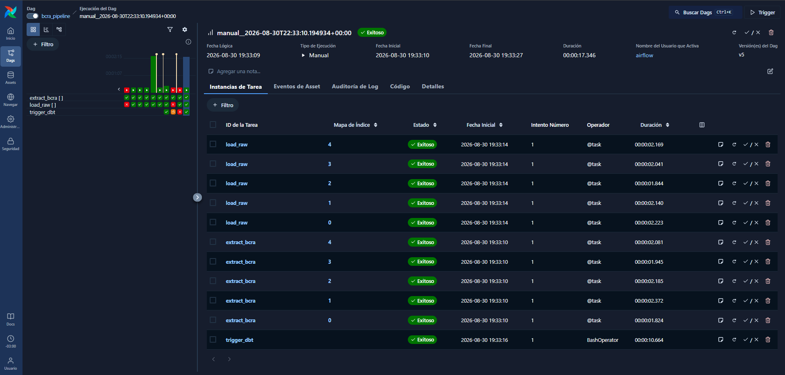
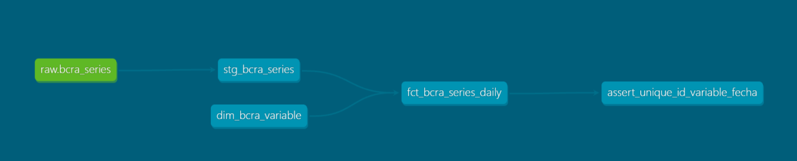

# BCRA Data Pipeline


## Descripción del proyecto

Pipeline de datos que extrae 5 series económicas de la API pública del **BCRA** (Banco Central de
la República Argentina), las carga de forma idempotente en PostgreSQL y las transforma con **dbt**,
todo orquestado por **Airflow** y empaquetado en **Docker Compose** — `docker compose up` y el
stack completo levanta solo, sin instalar nada a mano.

Es un proyecto explícitamente de **práctica**, no un repo insignia del portafolio: lo construí para
aislar y aprender bien las dos piezas de ingeniería de datos que el resto de mi portafolio no
mostraba — un **orquestador** y **transformación-como-código con tests** — antes de meterme con
`gharchive-data-platform`, un proyecto bastante más grande (MinIO, Parquet, Spark, CI) que va a dar
por sentado que estas dos herramientas ya las manejo. La fuente (una API chica, de payloads livianos
y sin volumen que gestionar) fue deliberada: quería pelearme con Airflow y dbt, no con la
infraestructura de la fuente al mismo tiempo.

## Arquitectura

```
API BCRA (5 series)
      │  Airflow · DAG diario · LocalExecutor
      ▼
extract_bcra   ──▶  GET por serie (dynamic task mapping, .expand)
      │              valida HTTP 200 y la forma del JSON
      ▼
load_raw       ──▶  Postgres raw.bcra_series
      │              UPSERT por (id_variable, fecha) — idempotente
      ▼
trigger_dbt    ──▶  dbt build
                     │
                     ├─ seed   dim_bcra_variable        (las 5 series, documentadas)
                     ├─ stg    stg_bcra_series           (vista, tipado sobre raw)
                     ├─ mart   fct_bcra_series_daily     (tabla, join con la dimensión)
                     └─ tests  not_null · unique · relationships
```

Un test de dbt que falla **corta el DAG en `trigger_dbt`**, sin afectar `extract_bcra`/`load_raw` —
probado en vivo insertando un dato inválido directo en `raw` (ver *Decisiones*).

## Las herramientas, y qué problema resuelve cada una

**Docker Compose** orquesta los 6 contenedores del stack (Airflow: API server, scheduler,
dag-processor, triggerer; más dos Postgres — metadata de Airflow y warehouse) desde un solo
`docker-compose.yml`, sin que nadie tenga que instalar Python, Airflow o Postgres en su máquina para
correr el proyecto.

**Airflow** es el orquestador: decide cuándo corre cada paso, en qué orden, reintenta si algo falla,
y deja un historial navegable de cada corrida. Sin él, "correr esto todos los días a las 3 AM y
avisarme si algo rompe" es un cronjob y un script de logging hechos a mano.

**dbt** transforma datos que ya están en la base escribiendo `SELECT`s versionados en vez de
scripts sueltos. La diferencia con el SQL de `czech-bank-sql-analytics` (mi otro proyecto de SQL
puro): acá el SQL sigue siendo mío, pero dbt lo organiza en capas con dependencias explícitas
(`raw → staging → marts`), genera el grafo de lineage solo, y le suma tests declarativos que
pueden cortar el pipeline.

## Las 5 series elegidas

| id | Serie | Periodicidad | Por qué |
|---|---|---|---|
| 1 | Reservas Internacionales | Diaria | Indicador macro de visibilidad pública alta |
| 4 | Tipo de Cambio Minorista | Diaria | El más consultado día a día en Argentina |
| 7 | BADLAR bancos privados (TNA) | Diaria | Ver *Decisiones* — hay una trampa real acá |
| 15 | Base Monetaria | Diaria | Variable más general que sus alternativas (ej. circulación monetaria) |
| 27 | Inflación Mensual | **Mensual** | Se prefirió sobre la interanual, que es derivable de esta |

Elección y justificación completas, incluida la exploración del catálogo de 1.610 series
disponibles, en [`docs/series.md`](docs/series.md).

## Decisiones que hay que poder defender

**`LocalExecutor`, no `CeleryExecutor`.** El `docker-compose.yaml` oficial de Airflow trae Celery
por defecto, con `redis`, `airflow-worker` y `flower` — reparto de tareas entre máquinas que en una
notebook no existen. Medido en esta máquina: el stack completo con `LocalExecutor` usa **~1,1 GB de
RAM**; con Celery hubiera sido ~2,6 GB, por el mismo paralelismo real (`LocalExecutor` lo consigue
con subprocesos). La acción concreta fue partir del compose oficial y borrar esos tres servicios.

**UPSERT, no append-only.** `raw.bcra_series` tiene `PRIMARY KEY (id_variable, fecha)` y el
`INSERT ... ON CONFLICT DO UPDATE` pisa el valor viejo con el nuevo. Es una decisión de dominio: el
BCRA revisa valores recientes, así que "el último GET gana" es lo correcto acá. El proyecto grande
(`gharchive-data-platform`) va a usar el patrón opuesto — append-only sobre particiones horarias
inmutables — porque ahí cada partición, una vez descargada, no cambia nunca. Que un mismo portafolio
tenga los dos patrones, cada uno justificado por su fuente, es más interesante que aplicar siempre
el mismo.

**La trampa de los `idVariable` duplicados del BCRA.** El catálogo tiene **8 series** con la palabra
BADLAR en la descripción. Las ids `7` y `35` son *la misma tasa*, expresada en convenciones
distintas — TNA (nominal) vs TEA (efectiva) — y dan números diferentes para el mismo día. Elegir
sin leer `unidadExpresion` te da un valor plausible y equivocado. Se eligió la `7` (TNA, con
historia desde 1999 contra 2020 de la `35`), documentado en `docs/series.md`.

**Granularidad mixta, sin romper nada.** La serie de inflación es mensual; las otras 4, diarias. La
API omite fines de semana y feriados incluso en las diarias, así que "hoy esta serie no trajo nada"
es el estado normal, no una excepción — `extract_bcra` lo tolera sin necesitar lógica especial: una
lista vacía simplemente no inserta filas.

**El quality gate se probó en vivo, no solo se asumió.** Se insertó a mano, directo en Postgres
(fuera del pipeline), una fila con `valor = NULL` en una fecha que el DAG nunca toca. Al disparar el
DAG, el test `not_null` de dbt la detectó (`Got 1 result, configured to fail if != 0`) y
`trigger_dbt` quedó en rojo — mientras `extract_bcra` y `load_raw` seguían en verde. Se limpió el
dato y se confirmó que el pipeline vuelve a verde solo.

## Cómo correrlo

```bash
git clone https://github.com/AgusPluda/bcra-data-pipeline.git
cd bcra-data-pipeline
cp .env.example .env   # completar FERNET_KEY (instrucciones adentro del archivo)
docker compose up -d --build
```

- UI de Airflow: **http://localhost:8080** (usuario/clave: `airflow` / `airflow`)
- Warehouse Postgres: `localhost:5433`, base `bcra`, usuario `bcra`
- Disparar el DAG `bcra_pipeline` desde la UI corre las 3 tasks de punta a punta: extracción de las
  5 series, carga idempotente, y `dbt build` (seed + modelos + tests).

Para correr dbt manualmente sin pasar por Airflow:

```bash
docker compose exec airflow-scheduler /opt/dbt-venv/bin/dbt build \
  --project-dir /opt/airflow/dbt --profiles-dir /opt/airflow/dbt
```

## Capturas





## Qué haría distinto

- El rango de fechas de `extract_bcra` está hardcodeado (`2026-08-01` a `2026-08-28`) en vez de ser
  dinámico (`hoy - N días`, o un backfill real con `catchup`). Fue deliberado — ese tema
  (`catchup`, pools, ramificación) queda para `gharchive-data-platform`, donde sí importa un
  backfill de semanas — pero en un pipeline que corra en producción de verdad, esto sería lo primero
  a resolver.
- `load_raw` abre una conexión a Postgres nueva por cada task instance (una por serie, vía
  `.expand()`). Para 5 series no importa; con más series querría un pool de conexiones.
- Ningún test de dbt cubre que la serie mensual (inflación) efectivamente llegue *alguna vez* al mes
  — hoy el pipeline tolera "0 filas hoy" sin distinguir "es normal, es mensual" de "la fuente dejó
  de publicar esta serie". Un `freshness` check de dbt sería la herramienta correcta acá.

## Qué sigue

Este repo cierra la práctica guiada de Airflow + dbt. El siguiente paso del roadmap es
`gharchive-data-platform`: mismo par de herramientas, ya incorporado, sumando Docker+MinIO+Parquet
+DuckDB+PySpark+CI sobre una fuente con volumen real (GH Archive).
